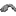

# IKun模组用户文档

<a href="README.md">English</a> | 简体中文

## 1. 模组简介

## 1.1 物品

- 坤笼`ikun_mod:chicken_coop`: 使用`minecraft:iron_bars`合成，用于召唤鸡坤，需要作为方块放置以后诱捕一只鸡`minecraft:chicken`来激活，等待2500Ticks后鸡坤会自动生成
    - 

- 坤式中分`ikun_mod:center_parted_wig`: 可以通过击杀【鸡坤】获得，作为头盔使用可以免疫【Crush on You】效果
    - 

## 1.2 生物

- 鸡坤`ikun_mod:chicken_ikun`
    - 生命值：250
    - 技能:
        - 坤跳: 近战范围攻击，伤害5，被命中会得到25Ticks的【Crush on You】效果
        - 坤摇: 远程攻击，发射小黑子`ikun_mod:xiao_hei_zi`，小黑子碰撞方块或者实体会产生1级爆炸，被命中会得到100Ticks的【Crush on You】效果
        - 苏珊六式: 大招，近战范围攻击，被选中会得到100Ticks的漂浮效果，漂浮过程中会被锁定然后产生2.5级爆炸，爆炸后会得到180Ticks的【Crush on You】效果
    - 机制:
        - 爆炸、摔落伤害免疫
        - 当鸡坤没有攻击目标时，会自动恢复生命值
        - 当实体有【Crush on You】效果时，无法对鸡坤进行攻击
        - 死亡后会掉落【坤式中分】

## 1.3 生物效果

- 【Crush on You】`ikun_mod:crush`: 被选中的实体无法对鸡坤进行攻击，玩家的视野会受到小黑子遮挡
    - 

## 1.4 成就

- 一战成坤`ikun_mod:adventure/beat_chicken_kun`：成功击杀【鸡坤】即可获得

## 2. 安装

请从[Releases](https://https://github.com/Jaffe2718/ikun_mod/releases)下载。

|      依赖项      |       说明       |
|:-------------:|:--------------:|
|     Java      |    1.21 LTS    |
|   Minecraft   |   根据模组需要选择版本   |
| Fabric Loader |   根据模组需要选择版本   |
|  Fabric API   |   根据模组需要选择版本   |
|   GeckoLib    | 4.x 根据模组需要选择版本 |

## 附录

本模组里面生物的动作动画使用[video2geckolib4](https://github.com/Jaffe2718/video2geckolib4)
工具从视频中进行动作捕捉生成。

[LICENSE](LICENSE)